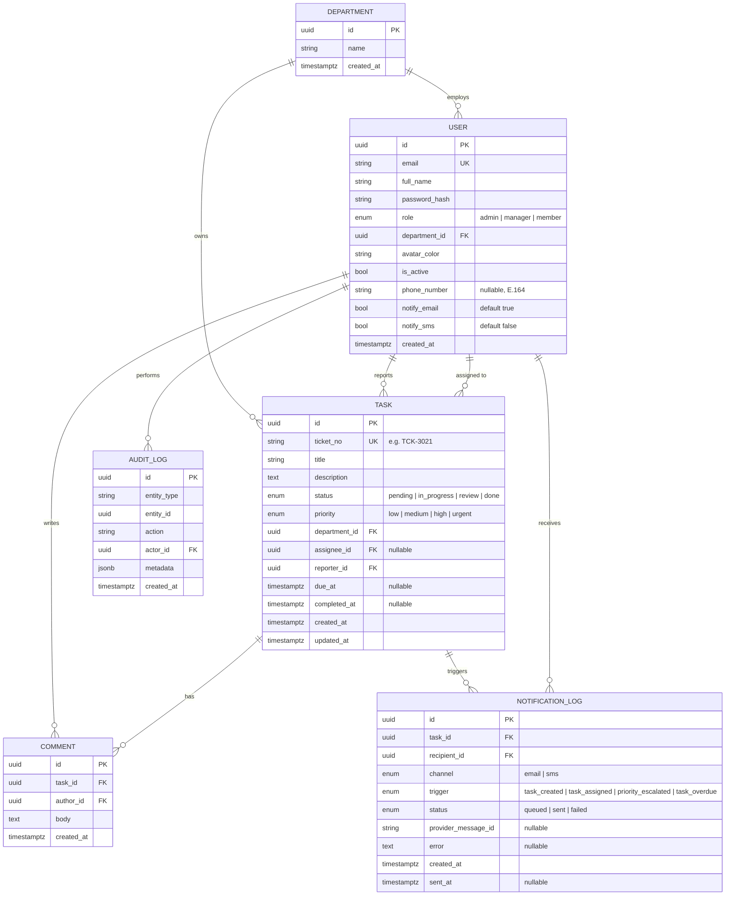

# Backend Architecture

Design for the HNBG Task Management System backend. This is the design
phase for the API layer that will power `prototypes/` and, eventually, a
real frontend built from `components/`.

## Stack

| Layer | Choice | Why |
|---|---|---|
| Language | Python 3.12 | Team preference confirmed for this project |
| Framework | **FastAPI** | Async-first, automatic OpenAPI docs, plays well with GraphQL via Strawberry, minimal boilerplate vs. Django for an API-only service |
| API style | **GraphQL** (Strawberry) | Single flexible endpoint for nested queries (task → assignee → department, dashboard stat aggregation) without over/under-fetching |
| ORM | SQLAlchemy 2.0 (async) | Mature, explicit, works cleanly with Alembic migrations |
| Database | PostgreSQL 15 | Relational integrity for tasks/users/departments; enums, full-text search, and JSONB (audit metadata) all built in |
| Migrations | Alembic | Standard pairing with SQLAlchemy |
| Auth | JWT (access + refresh) via `python-jose`, passwords via `passlib[bcrypt]` | Stateless, scales horizontally, matches the "JWT + RBAC, single-org" decision |
| Background jobs | Celery + Redis | Async SMS/email notifications for high-priority tickets, overdue-digest jobs |
| SMS | Twilio | Industry-standard, simple REST API, good deliverability |
| Email | SMTP (swappable for SendGrid/SES) | stdlib `smtplib` needs no extra dependency to start; swap the provider function later without touching call sites |
| Containerization | Docker Compose (api, db, redis, worker) | Consistent local/dev/prod parity |

**Why not Django, given it was on the table:** GraphQL was chosen for the
API style, and Strawberry + FastAPI gives a lighter, fully async, type-hint
-driven GraphQL layer without carrying Django's synchronous ORM and
batteries-included admin/templating we don't need for an API-only service.
Django remains a reasonable fallback if the team later wants the built-in
admin panel for department/user management instead of building that UI.

**Multi-tenancy:** out of scope per the auth decision (single-org). The
schema is intentionally left easy to extend with an `organization_id` later
if HNBG needs to onboard other companies onto the same deployment.

---

## Data model (ERD)



### Notes

- **`ticket_no`** is a generated, human-readable identifier (`TCK-0001`,
  `TCK-0002`, ...) matching the `#TCK-3021` style already shown in the
  prototypes. Generate via a Postgres sequence, not the raw UUID.
- **`status`** maps 1:1 to the prototype's status chips (`pending`,
  `progress`, `review`, `done` in the HTML/CSS class names).
- **`priority`** maps 1:1 to the segmented control in `create-task.html`
  (`low`, `medium`, `high`, `urgent`).
- **`department_id`** on `TASK` reflects the recent UI change that replaced
  the "Project" field with "Department" on the create-task form.
- **`AUDIT_LOG`** is optional for v1 but recommended for an enterprise
  system — track who changed status/assignee/priority and when, without
  bloating the `TASK` row itself.
- **NOTIFICATION_LOG** is the audit trail for every SMS/email send attempt
  (see Notifications section below): one row per (task, recipient,
  channel) combination, independent of `AUDIT_LOG` since it tracks
  delivery status of an outbound message, not a change to a task.

---

## RBAC — roles & permissions

| Action | Admin | Manager | Member |
|---|---|---|---|
| View own department's tasks | ✅ | ✅ | ✅ |
| View all departments' tasks | ✅ | ❌ | ❌ |
| Create task | ✅ | ✅ | ✅ |
| Assign task to anyone in dept | ✅ | ✅ | ❌ (can assign to self only) |
| Edit any task in own dept | ✅ | ✅ | ❌ (own tasks only) |
| Delete task | ✅ | ✅ (own dept) | ❌ |
| Comment on task | ✅ | ✅ | ✅ |
| Manage users (invite/deactivate) | ✅ | ❌ | ❌ |
| Manage departments | ✅ | ❌ | ❌ |
| View audit log | ✅ | ✅ (own dept) | ❌ |

Enforced via a GraphQL field/resolver-level permission layer (Strawberry
`Permission` classes), not just at the HTTP route level — every resolver
that touches `Task`/`User`/`Comment` checks the requesting user's role and
department against the target record.

---

## Notifications (SMS + Email for high/urgent tickets)

High-priority tickets need to reach someone faster than a dashboard
refresh. Notifications are async, best-effort, and fully logged rather
than blocking the request that triggered them.

**Triggers**

| Trigger | Fires when |
|---|---|
| `TASK_CREATED` | A new task is created with `priority` HIGH or URGENT |
| `TASK_ASSIGNED` | A task's `assignee_id` is set/changed while priority is HIGH or URGENT |
| `PRIORITY_ESCALATED` | An existing task's priority is edited *into* HIGH or URGENT (not on every edit of an already-high-priority task, to avoid notification fatigue) |
| `TASK_OVERDUE` | The Celery beat overdue sweep finds a HIGH/URGENT task past `due_at` and still not done |

**Channels**

- **Email** — stdlib `smtplib` (`MIMEText`), configured via `SMTP_HOST` /
  `SMTP_PORT` / `SMTP_USERNAME` / `SMTP_PASSWORD` / `SMTP_FROM_EMAIL` /
  `SMTP_USE_TLS`. Swappable later for SendGrid/SES without touching call
  sites — only `_send_email()` in `app/services/notifications.py` changes.
- **SMS** — Twilio, configured via `TWILIO_ACCOUNT_SID` /
  `TWILIO_AUTH_TOKEN` / `TWILIO_FROM_NUMBER`. Imported lazily so the
  `twilio` package is only required if SMS is actually enabled.

Both channels are gated globally by `NOTIFICATIONS_ENABLED` and per-priority
by `NOTIFY_PRIORITIES` (default `"high,urgent"`) in `app/core/config.py`.

**Recipients**

`recipients_for_task()` resolves who gets notified:

- The task's `assignee` always, if `assignee.notify_email`/`notify_sms` is
  on and (for SMS) they have a `phone_number` on file.
- For `URGENT` tasks only, department managers/admins are added as
  escalation recipients, de-duplicated against the assignee.

Each user controls their own opt-in per channel
(`User.notify_email`, `User.notify_sms`) via the
`updateNotificationPreferences` mutation — nobody is texted without
explicitly turning SMS on and supplying a phone number.

**Delivery**

`enqueue_if_needed(task, trigger)` is called from the mutation-resolver
layer (`task_service.create_task` / `update_task`) and does nothing if the
task's priority isn't in `NOTIFY_PRIORITIES` — otherwise it fires a Celery
task (`send_task_notifications`, `bind=True, max_retries=3`) so the
GraphQL mutation itself returns immediately and isn't blocked by a slow
SMTP/Twilio call. Each send attempt writes a `NotificationLog` row
(`QUEUED` → `SENT`/`FAILED`, with `provider_message_id` or `error`
captured) for audit and for debugging delivery problems.

---

## GraphQL schema (v1 draft)

See [`../backend/app/graphql/schema.graphql`](../backend/app/graphql/schema.graphql)
for the full SDL. Summary:

**Queries**
- `me: User`
- `dashboardStats(departmentId: ID): DashboardStats` — powers the four
  status tiles (Pending / In Progress / Overdue / Completed)
- `tasks(filter: TaskFilter, sort: TaskSort, page: PageInput): TaskConnection`
- `task(id: ID!): Task`
- `departments: [Department!]!`
- `users(departmentId: ID): [User!]!`

**Mutations**
- `login(email: String!, password: String!): AuthPayload`
- `refreshToken(token: String!): AuthPayload`
- `createTask(input: CreateTaskInput!): Task`
- `updateTask(id: ID!, input: UpdateTaskInput!): Task`
- `assignTask(id: ID!, assigneeId: ID): Task`
- `changeTaskStatus(id: ID!, status: TaskStatus!): Task`
- `deleteTask(id: ID!): Boolean`
- `addComment(taskId: ID!, body: String!): Comment`
- `updateNotificationPreferences(input: NotificationPreferencesInput!): User`
  — self-service opt-in/out for email/SMS notifications

**Design conventions**
- Cursor-based pagination (`TaskConnection` / `PageInfo`, Relay-style) for
  the task list, since it needs to scale to enterprise task volumes.
- All mutations return the affected object so the frontend can update its
  cache without a refetch.
- Errors use typed GraphQL error extensions (`code: "VALIDATION_ERROR"`,
  `code: "FORBIDDEN"`, etc.) rather than bare strings, so the frontend can
  branch on error type (e.g. show the inline red error on Title like the
  Create Task form already does).

---

## Project layout (`backend/`)

```
backend/
├── README.md
├── requirements.txt
├── .env.example
├── docker-compose.yml
├── Dockerfile
├── alembic.ini
├── app/
│   ├── main.py                 # FastAPI app, mounts GraphQL router
│   ├── core/
│   │   ├── config.py           # Settings (pydantic-settings, reads .env)
│   │   ├── database.py         # Async SQLAlchemy engine/session
│   │   └── security.py         # Password hashing, JWT encode/decode
│   ├── models/                 # SQLAlchemy ORM models
│   │   ├── department.py
│   │   ├── user.py
│   │   ├── task.py
│   │   ├── comment.py
│   │   └── notification_log.py # SMS/email delivery audit trail
│   ├── graphql/
│   │   ├── schema.graphql      # SDL reference (source of truth for docs)
│   │   ├── schema.py           # Strawberry schema assembly
│   │   ├── types.py            # Strawberry object types
│   │   ├── queries.py
│   │   ├── mutations.py
│   │   └── permissions.py      # RBAC checks per resolver
│   ├── services/
│   │   ├── task_service.py     # Business logic (ticket_no generation, overdue calc)
│   │   └── notifications.py    # SMS (Twilio) + email (smtplib) send + logging
│   └── core/
│       └── celery_app.py       # Celery app, beat schedule, task registration
└── migrations/
    └── versions/                # Alembic migration files
```

---

## Deployment considerations

- **Horizontal scaling:** stateless API pods behind a load balancer; JWT
  auth means no server-side session store needed for scaling.
- **Caching:** Redis for both Celery broker and a query-result cache for
  `dashboardStats` (recomputing severity-scale colors doesn't need to hit
  Postgres on every dashboard load).
- **Background jobs:** a scheduled Celery beat task flips tasks to
  "overdue" status (or computes it at query time — see open question
  below) and sends daily digest notifications.
- **Observability:** structured JSON logging + request ID middleware from
  day one; wire to whatever HNBG's log aggregator is once decided.
- **CI/CD:** extend `.github/workflows/deploy.yml` with a second job that
  runs `pytest`, `alembic upgrade head --sql` (migration dry-run), and
  builds/pushes the Docker image once this scaffold has real code in it.

## Open questions for the next design pass

1. Is "Overdue" a stored status or a computed property (`due_at < now() AND status != done`)? Leaning computed — avoids a background job needing to mutate every row.
2. Do Members need to see tasks outside their own department at all (e.g. cross-department dependencies), or is department isolation strict?
3. File attachments on tasks/comments — in scope for v1 or later?
4. ~~Notification channels~~ — resolved: SMS (Twilio) + email (SMTP) for
   HIGH/URGENT tickets, see Notifications section above. Slack integration
   remains a candidate future channel if HNBG wants it.
5. In-app (bell icon / notification center) notifications aren't covered
   yet — current scope is SMS + email only, per the explicit request.
